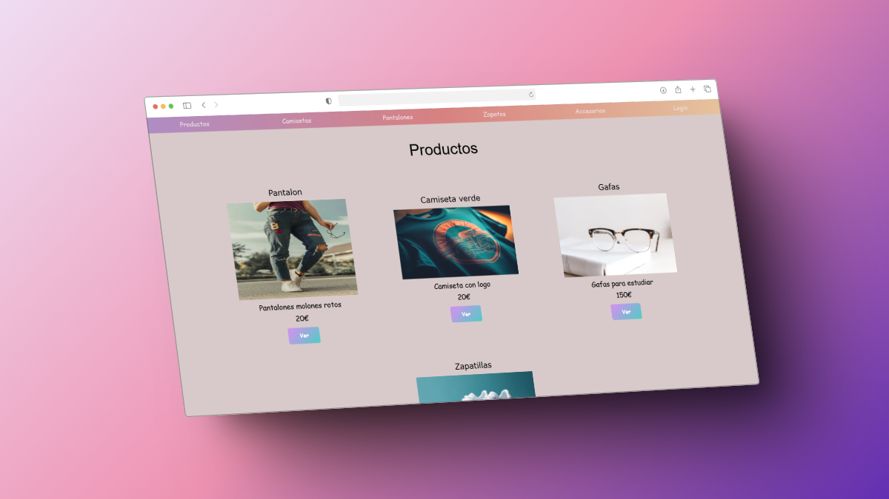

<div align="center">

# Tienda de ropa

Esta es una aplicación web en **Node.js** utilizando **Express** con **mongoose** para crear una tienda de ropa con un catálogo de productos y un dashboard para el administrador. Los productos se guardarán en una base de datos de **MongoDB** en **Atlas**.



      

</div>

## 📚 Índice

  - [Estructura de archivos](#estructura-de-archivos)
  - [Características de los archivos](#características-de-los-archivos)
  - [Funciones del Controlador de Productos](#funciones-del-controlador-de-productos)
  - [Funciones del Controlador de la API](#funciones-del-controlador-de-la-api)
  - [Funciones del Controlador de Autenticación](#funciones-del-controlador-de-autenticación)
  - [Endpoints de la App](#endpoints-de-la-app)
  - [Funcionamiento de la aplicación](#funcionamiento-de-la-aplicación)

## 🛠️ **Tecnologías utilizadas**

- **📄 HTML, 🎨 CSS y ⚡ JavaScript** para la estructura, estilos y funcionalidades interactivas.
- **🖥️ Node.js** y **🚀 Express** para el desarrollo del backend.
- **💾 MongoDB** y **Mongoose** para la persistencia de datos.
- **🔒 Firebase Authentication** para el control de autenticación de usuarios.
- **📜 Swagger** para la documentación de la API.
- **🧪 Jest** para realizar pruebas unitarias.


## 📂 **Estructura de archivos**

La aplicación 'Tienda de ropa' posee la siguiente estructura de archivos: 

```
.
├── public
│   ├── styles.css
│   └── images
├── src
│   ├── config
│   │   ├── config.js
│   │   ├── db.js
│   │   └── firebase.js
│   ├── controllers
│   │   ├── apiController.js
│   │   ├── productController.js
│   │   └── authController.js
│   ├── docs (swagger)
│   │   ├── basicInfo.js
│   │   ├── components.js
│   │   ├── index.js
│   │   └── products.js
│   ├── middlewares
│   │   └── authMiddlewares.js
│   ├── models
│   │   └── Product.js
│   ├── routes
│   │   └── apiRoutes.js
│   │   └── authRoutes.js
│   │   └── productRoutes.js
│   ├── test
│   │   └── productController.test.js
│   └── index.js
├── .gitignore
├── .env
├── package.json
└── README.md

```

# 📌 Proyecto Tienda de Ropa - Backend en Node.js

Este proyecto es el backend de una tienda de ropa, desarrollado con **Node.js**, **Express**, **MongoDB** y **Firebase**. Incluye autenticación de usuarios, gestión de productos y una API REST.

---

## 📂 Estructura de Archivos

### 🛠 Configuración
- **`config/config.js`**: Genera una clave secreta con `crypto` y la hashea con `bcrypt`.
- **`config/db.js`**: Configura la conexión a MongoDB mediante Mongoose y `.env`.
- **`config/firebase.js`**: Inicia la conexión con Firebase para autenticación.

### 🚀 Controladores
- **`controllers/apiController.js`**: Gestiona las solicitudes CRUD de productos para la API.
- **`controllers/authController.js`**: Maneja el registro, login y logout de usuarios con Firebase Authentication.
- **`controllers/productController.js`**: Controla la lógica para las operaciones CRUD en productos, devolviendo respuestas en HTML.

### 📄 Documentación con Swagger
- **`docs/basicInfo.js`**: Contiene la especificación OpenAPI.
- **`docs/components.js`**: Define los esquemas de documentación.
- **`docs/index.js`**: Exporta la documentación de Swagger.
- **`docs/products.js`**: Especifica los endpoints para OpenAPI.

📌 *Para visualizar la documentación con Swagger, accede a la URL principal del servidor y añade `/api` al final.*

### 🔒 Middlewares
- **`middlewares/authMiddlewares.js`**: Middleware para verificar la autenticación con Firebase.

### 📌 Modelos
- **`models/Product.js`**: Define el esquema de productos en MongoDB.

### 🌐 Rutas
- **`routes/apiRoutes.js`**: Define las rutas de la API.
- **`routes/authRoutes.js`**: Maneja las rutas de autenticación.
- **`routes/productRoutes.js`**: Gestiona las rutas de productos.

### 🏁 Principal
- **`index.js`**: Inicia el servidor Express, conecta MongoDB, configura rutas y maneja sesiones.

### 🧪 Tests
- **`test/productController.test.js`**: Contiene pruebas unitarias y mock functions.

### 🎨 Archivos Estáticos
- **`public/styles.css`**: Estilos de la aplicación.
- **`public/images`**: Carpeta con imágenes de productos.

### 🔑 Variables de Entorno
- **`.env`**: Contiene la URI de MongoDB, credenciales de Firebase y puerto del servidor.

### 📦 Dependencias
- **`package.json`**: Lista de dependencias y scripts (`start` y `dev`).

---

## 🔥 Endpoints Principales

### 🛍 Para Clientes
- `GET /products/` → Lista todos los productos.
- `GET /products/:productId` → Muestra un producto específico.

### 📡 API (Formato JSON)
- `GET /api/products/` → Devuelve todos los productos.
- `GET /api/products/:productId` → Devuelve un producto por ID.

### 🔐 Para Administradores (Requiere Autenticación)
- `GET /dashboard/` → Panel de productos.
- `GET /dashboard/new` → Formulario para crear un nuevo producto.
- `GET /dashboard/:productId/edit` → Editar un producto.
- `GET /dashboard/:productId/delete` → Eliminar un producto.
- `GET /login/` → Formulario de login.
- `GET /register/` → Formulario de registro.
- `GET /logout/` → Cerrar sesión.

📌 *Nota:* Se usa `checksession` como middleware para validar autenticación.

---

## ⚙️ **Funcionamiento de la aplicación**

La aplicación está construida con **Node.js** y **Express**, y utiliza una variedad de dependencias como **Mongoose** para la base de datos, **Firebase Authentication** para el control de usuarios, y **Swagger** para la documentación de la API. Además, se han implementado pruebas utilizando **Jest**.

- **bcrypt**: Para el hash de contraseñas.
- **mongoose**: Para interactuar con la base de datos MongoDB.
- **express-session**: Para manejar las sesiones de usuario.
- **swagger-ui-express**: Para mostrar la documentación de la API.

## ⚙️ Cómo Configurar y Usar este Proyecto

1️⃣ **Clonar el repositorio**
```sh
 git clone https://github.com/s0raya/backend-project-break.git
```

2️⃣ **Instalar dependencias**
```sh
 npm install
```

3️⃣ **Configurar el archivo `.env`**
```sh
 PORT=5000
 MONGODB_URI=mongodb+srv://tu_usuario:tu_password@tu_cluster.mongodb.net/tu_base_de_datos
 FB_APIKEY = ""
 FB_DOMAIN = ""
 FB_PROJECTID = ""
 FB_STORAGEBUCKET = ""
 FB_SENDERID = ""
 FB_APPID = ""
```

4️⃣ **Ejecutar el servidor**
- Modo normal: `npm start`
- Modo desarrollo (con nodemon): `npm run dev`

5️⃣ **Acceder a la aplicación**
- **Frontend:** `http://localhost:5000`
- **API:** `http://localhost:5000/api/products`
- **Swagger:** `http://localhost:5000/api`

🚀 ¡Listo! Ahora puedes probar la aplicación. 🎉


## 🚀 **Mejoras futuras**

- 📱 **Adaptabilidad para todo tipo de dispositivos**: Hacer que la aplicación sea completamente **responsiva** y adaptada a cualquier tamaño de pantalla, para una mejor experiencia en **móviles** y **tabletas**.
- 🔒 Implementar **recuperación de contraseñas** para los usuarios registrados.
- 🖼️ Incluir **filtros avanzados** en el catálogo de productos, como búsqueda por categoría, precio, etc.